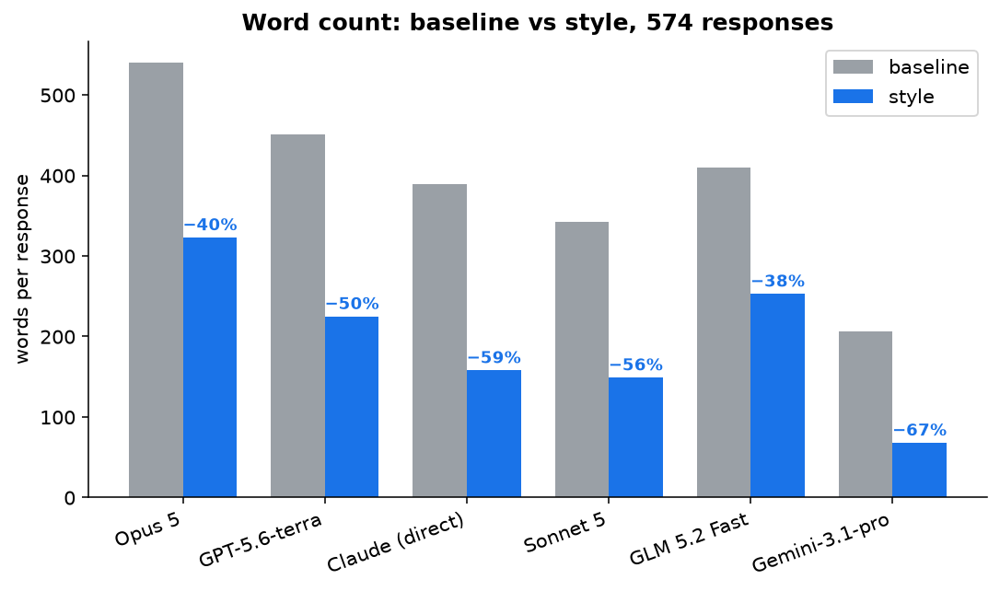

# terse-agent-output

An output style for agents. Result-first, verbatim errors, no preamble, no fabrication. Forked from [attention-control](https://github.com/aaddrick/attention-control) with three evidence-driven fixes. Proven across six models.

Agents write too much and hedge too often. This rule fixes both. It is a discipline, not a personality — and it is measurable. See [`eval-results.md`](eval-results.md) for the full evaluation, and [`evals/`](evals/) for the raw responses, prompts, and scoring script (`python3 evals/score.py` reproduces the tables).



## Install

One style, three harnesses. Pick your harness:

| Harness | Style | Enforcement | Directory |
|---|---|---|---|
| **OMP** | `omp/terse.md` | `omp/no-forbidden-openers.md` (TTSR) | [`omp/`](omp/) |
| **Pi** | `pi/terse.md` | none (no stream rules) | [`pi/`](pi/) |
| **Claude Code** | `claude/terse.md` | none (no stream rules) | [`claude/`](claude/) |

OMP and Pi share the same style file. Claude Code uses a variant with Claude frontmatter and the TTSR enforcement section removed. Each harness directory has its own install README.

Quick install:

```bash
# OMP (style + enforcement)
curl -L -o ~/.omp/agent/rules/terse.md https://github.com/stray-nick/terse-agent-output/releases/latest/download/terse.md
curl -L -o ~/.omp/agent/rules/no-forbidden-openers.md https://github.com/stray-nick/terse-agent-output/releases/latest/download/no-forbidden-openers.md

# Pi (style only)
curl -L -o ~/.pi/agent/rules/terse.md https://github.com/stray-nick/terse-agent-output/releases/latest/download/terse.md

# Claude Code (style only)
curl -L -o ~/.claude/output-styles/terse.md https://github.com/stray-nick/terse-agent-output/releases/latest/download/claude-terse.md
```

**Enforcement caveat (OMP only):** the TTSR rule works in interactive sessions but hangs in `-p` (print) mode. Remove `no-forbidden-openers.md` if you rely on scripted `-p` runs.

## What it does

Reshapes output. Same work done. Backed by a full eval, not a spot check:

- **576 prose responses across six models** (Opus 5, GPT-5.6-terra, Gemini-3.1-pro, Sonnet 5, GLM 5.2 Fast, Claude): word count −38 to −67%, passive voice −76 to −95%, long sentences to 0–4%.
- **Held-out generalization**: 16 fresh prompts reproduce the effect within 3–4 points on three models — the dev-split overfitting concern is retired.
- **Task-success (120 tool-using runs, 2 models)**: totals within noise (baseline 57/60, style 56/60). The style improves honesty probes; one weak spot — on ambiguous tasks it acts rather than asks.
- **Blind judge (91 judgments, blind to condition)**: styled responses are slightly *more* correct and better calibrated; the real cost is completeness (−0.93 on a 1–5 scale) — compression leaves some of what was asked unsaid.
- **Economics**: net cost savings on every model, conditional on cache hits (cache assumption validated). On thinking=high models the visible-prose savings overstate total-billed savings — thinking is ~55–64% of output and compresses less.

See [`eval-results.md`](eval-results.md) for the full evaluation and [`evals/`](evals/) for raw data, prompts, harnesses, and `score.py` (regenerates every table). The honest limitations — including the completeness cost and the clarifying-question weakness — are documented there, not hidden.

## The three fixes over attention-control

1. **Verbatim override.** Error strings reproduced character-for-character. The original paraphrased them.
2. **No-tools deadlock guard.** The agent answers in prose when it has no tools. The original went silent.
3. **Deference calibration.** General knowledge is not fabrication. The original over-deferred on knowledge questions.

## The three sources

- [attention-control](https://github.com/aaddrick/attention-control) by aaddrick — the concept and the evaluation harness. Proven portable across six models.
- [i-have-adhd](https://github.com/ayghri/i-have-adhd) by Ayoub G. (MIT) — the shape layer (result-first, no preamble).
- [asd-ste100](https://gist.github.com/L1nefeed/4164ecaaf77879e76dca3c06f142f1c2) by L1nefeed, adapted from [ASD-STE100](https://www.asd-ste100.org/) Issue 9 — the language layer (active voice, simple tenses).

This fork drops the air-traffic-control framing in favor of a direct discipline, adds the three fixes, and packages the rule for OMP and Pi.

## License

MIT for the original contributions in this repo. See [`LICENSE`](LICENSE). The upstream attribution chain is in [`NOTICE.md`](NOTICE.md) — attention-control (MIT) and i-have-adhd (MIT) are clean, but the asd-ste100 language layer derives from an unlicensed gist adapting a trademarked standard, and its license status is uncertain. Read `NOTICE.md` before relying on the full chain for commercial use.
