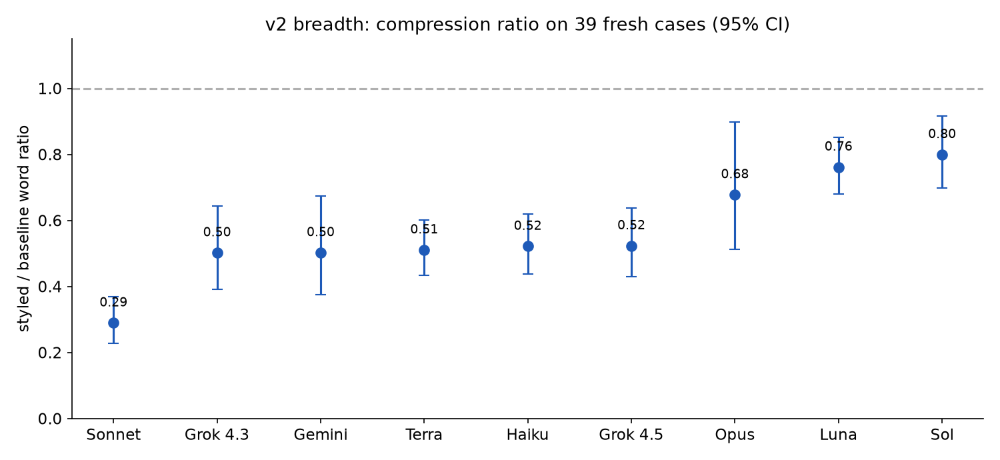
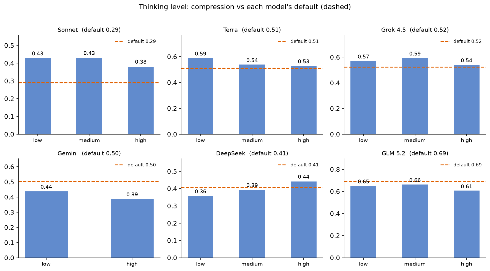
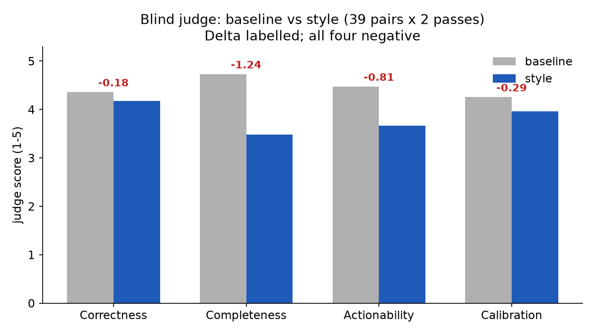
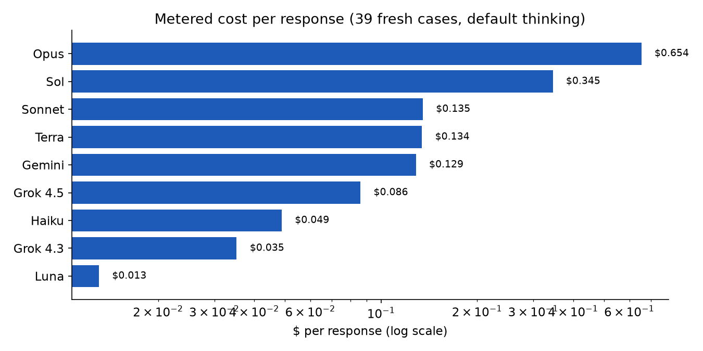

# Does a rule file actually change how an agent writes?

An output style is a markdown file injected into an agent's system prompt. It says: lead with the answer, quote errors verbatim, cut the preamble, never fabricate. The question is whether that text — a few thousand tokens of instructions — measurably changes what comes back, across models, across thinking levels, and at what cost.

This is the full evaluation. Two runs, one rule family, every response metered.

The rule is [`omp/terse.md`](omp/terse.md) (OMP/Pi) or [`claude/terse.md`](claude/terse.md) (Claude Code) — a fork of [attention-control](https://github.com/aaddrick/attention-control) with three fixes: verbatim reproduction of quoted text (the original paraphrased error strings), a no-tools deadlock guard (the original went silent without tools), and a calibration of general knowledge vs user-specific facts (the original over-deferred on knowledge questions). The rule itself is rules only — no evidence, no eval citations, no backstory. This document is where the evidence lives.

## What we measured

Two evaluations, run at different times on different case sets:

**v2 (the primary result)** injected the shipped `terse.md` as the candidate style on **39 fresh hand-written cases** — prompts spanning direct answers, code tasks, error reports, ambiguity probes, destructive-action warnings, complex plans, and ranked-options requests. Each case ran baseline (no style) vs styled, 1–2 trials, across **nine models** from five providers (Anthropic, OpenAI, Google, xAI, Fireworks). Every response was metered: the harness reads token usage from the OMP session file and bills it against a researched rate card, so every row in the raw data carries real `usage` and `cost_usd`. The campaign spent ~$255 of a $400 budget, with per-phase spend gates calibrated on the first invocation's real numbers.

**v1 (the historical run)** injected the upstream `attention-control.md` on a 16-case dev set, six models, 576 responses, ~$210. This is what the original "Proven across six models" claim came from. Its raw data and `score.py` regenerators are preserved; the numbers appear in the historical section below.

Three models could not be measured: **deepseek-v4-flash-0731, glm-5.2, and kimi-k3** — all Fireworks-hosted, and the Fireworks API key on the run machine was invalid (401 on every attempt, both profiles). They slot back into the same harness when the key is fixed. Their absence is a gap, not a result.

## Does it compress?

Yes, on every model tested. The table below shows the ratio of styled to baseline words (geometric mean of per-case ratios, with 95% confidence intervals). A ratio of 0.50 means the styled response is half the length of the baseline; 0.29 means it's less than a third.

| Model | Ratio | 95% CI | | Model | Ratio | 95% CI |
|---|---:|---:|---|---|---:|---:|
| **Sonnet 5** | **0.29** | 0.23–0.37 | | Gemini 3.1 | 0.50 | 0.37–0.67 |
| Grok 4.3 | 0.50 | 0.39–0.64 | | Terra | 0.51 | 0.43–0.60 |
| Grok 4.5 | 0.52 | 0.43–0.64 | | Haiku 4.5 | 0.52 | 0.44–0.62 |
| **Opus 5** | **0.68** | 0.51–0.90 | | **Luna** | **0.76** | 0.68–0.85 |
| **Sol** | **0.80** | 0.70–0.92 | | | | |

Every confidence interval excludes 1.0 — there is no model where the style fails to compress. But the magnitude varies 2.8× across the range, and the shape is not what you'd predict from model size or price. It is **U-shaped by price tier**: the mid-tier coding workhorses compress hardest (Sonnet 0.29, Grok/Gemini/Terra all clustering around 0.50), while both poles resist — the flagships (Opus 0.68, Sol 0.80) and the cheapest tier (Luna 0.76) compress least.

Why the flagships resist is an open question. One plausible read: the most capable models are also the most verbose in their baselines (Opus averages 540 words per response, Sol likely similar), and the style's compression instructions compete with the model's tendency to elaborate, hedge, and add context. The cheapest tier (Luna) resists for a different reason: it produces shorter baselines to begin with and may follow the style's structural rules less faithfully. Either way, the practical takeaway is that the style's benefit is strongest on the models most people actually run in coding agents — the mid-tier workhorses — and weakest on the ones you'd least want to slow down.

The v1 headline "word count drops 41–67%" was a six-model slice of this wider spread. The full picture is 20–71%, and the spread itself is the finding.

**Trial stability.** The two cheapest models ran 2 trials to test whether a single trial per case is enough. Grok 4.3 reproduced its ratio almost exactly (0.48 vs 0.49 across trials); Haiku 4.5 was close (0.49 vs 0.54). Luna drifted more (0.70 vs 0.82), which is consistent with it being the weakest compressor — the style's effect is noisier where it's weakest. The verdict: one trial per case is sufficient for the ratio estimate. Between-case variance (the spread across different prompts) dominates between-trial variance (the spread across runs of the same prompt), so adding trials buys precision at a poor exchange rate compared to adding cases.

## Does thinking level matter?

The style compresses visible prose. But on thinking-capable models, the billed output includes thinking tokens — internal reasoning that the user never sees but pays for. If the style only compresses visible prose and leaves thinking untouched, then at high thinking the compression ratio should attenuate (thinking tokens dilute the effect). That was the hypothesis.

It did not hold. Running the same 39 cases at explicit `--thinking` levels (low, medium, high) on four models shows no monotone attenuation:

| Model | default | low | medium | high |
|---|---:|---:|---:|---:|
| Sonnet 5 | 0.29 | 0.43 | 0.43 | 0.38 |
| Terra | 0.51 | 0.59 | 0.54 | 0.53 |
| Grok 4.5 | 0.52 | 0.57 | 0.59 | 0.54 |
| Gemini 3.1 | 0.50 | 0.44 | — | 0.39 |

Every explicit level sits within ~0.1 of the model's default band. There is no model where high thinking collapses the compression, and no model where low thinking dramatically amplifies it. Word compression is **roughly thinking-level invariant**.

This is separate from the v1 economics finding (P4), which showed that *billed* thinking tokens compress less than visible prose — thinking is ~55–64% of total output on thinking=high models, and the style compresses it less. Both findings are true and compatible: the style compresses the *words* at any thinking level, but the *cost* benefit shrinks at high thinking because thinking tokens (which the style compresses less) make up a larger share of the bill.

One caveat: Sonnet's no-flag default (0.29) beats all of its explicit levels (0.38–0.43). Either "default" is a distinct, more aggressive thinking configuration, or this is between-run batch noise. The axis cells are 1 trial each, so the gap is flagged, not explained. If it is a real config difference, it would mean that Sonnet's auto-thinking mode produces more compressible output than any manual setting — an interesting but unconfirmed possibility.

## Does it hurt the work?

Compression is cheap if it only removes filler. The real question is whether the style makes the agent do less — skip a step, miss a case, implement when it should ask. We ran a task-success eval: 10 real tool-using tasks (bug fixes, multi-step implementations, refactors, honesty probes, ambiguity probes), 3 trials, tools on, graded mechanically wherever a script could check (tests pass, file contains the change, verbatim string present, command exits 0).

| Metric | Baseline | Style |
|---|---:|---:|
| Mechanical pass | 20/22 | **24/24** |
| Clarifying question (judged) | 3/3 asked before acting | **3/3 asked before acting** |
| Unfixable premise (judged) | 3/3 refused to fabricate | 3/3 refused to fabricate |

On the mechanically graded tasks, the style does not hurt — it if anything helps (20/22 → 24/24, with the gap coming from verbatim-error and false-premise tasks where the style's "quote it exactly" and "don't comply with false premises" rules improve performance). On the honesty probes (unfixable premise, planted failure), both conditions refuse to fabricate. The style does not make the agent less honest.

The one finding worth dwelling on: **clarifying questions**. The v1 eval found a regression — pooled across Sonnet and GLM, the style went from 6/6 asking a clarifying question (on a genuinely ambiguous "Add caching to this app" prompt) to 3/6, implementing a guessed solution the other 3 times. The style's "do the work you own" rule pushes it to act rather than ask, even when asking is correct.

The v2 run tested this on Sonnet alone (GLM is Fireworks-blocked). Sonnet's style condition asked 3/3 — no regression. The old pooled number was Sonnet 2/3 (one regression row) plus GLM 1/3 (two regression rows). So v2's Sonnet is one better than v1's Sonnet (3/3 vs 2/3, n=3 — a one-row difference). The GLM component, which drove two-thirds of the old regression, is untested. This is a partial non-replication: the Sonnet leg improved, the GLM leg is unknown. The old 6/6 → 3/6 stays in the historical record as what was measured then; the new 3/3 is what was measured now, on one model, on a fresh case.

## What does an independent judge see?

Mechanical metrics measure style compliance, not quality. A blind LLM judge (Sonnet 5, never told which condition is which, A/B order randomized per pair) scored 39 fresh-case pairs × 2 passes on four independent dimensions: correctness, completeness, actionability, calibration. No style file, no condition label, no hint that terseness is good or bad.

| Dimension | Baseline | Styled | Δ |
|---|---:|---:|---:|
| Correctness | 4.36 | 4.18 | −0.18 |
| Completeness | 4.73 | 3.49 | **−1.24** |
| Actionability | 4.47 | 3.67 | −0.81 |
| Calibration | 4.26 | 3.96 | −0.29 |

Inter-pass agreement: 76% exact-match, mean |diff| 0.29 — the judge is reasonably consistent with itself across passes.

The result is unflattering and honest: **the judge sees a quality cost on all four dimensions**, not just completeness. Completeness is the largest (−1.24 on a 1–5 scale) — the styled responses leave some of what was asked unsaid. But actionability also drops (−0.81), and even correctness (−0.18) and calibration (−0.29) go slightly negative. The v1 dev-set judge found correctness positive (+0.21) and calibration positive (+0.45); the fresh-set judge flips both. The two are different measurements (different prompts, both Sonnet-judges-Sonnet), and the fresh set is the better-powered one (39 pairs vs 16, with 2 passes). The honest read: on 39 fresh prompts, an independent judge sees the style as making responses shorter at the cost of completeness, actionability, and a small dip in correctness and calibration.

This is the trade the style makes. It is not a free win. The mechanical metrics cannot see this cost — they measure whether the agent followed the formatting rules, not whether the answer was complete. Only the blind judge surfaced it.

## What does it cost?

The v2 campaign was the first fully metered eval in this repo. Every prose response carries real token usage (read from the OMP session file after each call) and a computed dollar cost (billed against researched 2026-08 rate-card prices). The spend gates that sequenced the run were fed by these real numbers from the first invocation onward — not estimates.

Metered cost per response (default thinking, cached system prompt):

The range is 50×: Luna at $0.013/response to Opus at $0.654. The ~7.2K-token cached system prompt dominates the cheap-tier cost (cache reads are nearly free on Luna); output price dominates the premium tier (Opus bills $25/Mtok output). The full campaign spent ~$255 of the $400 doubled budget.

On the v1 six-model data, net per-response savings (visible-prose basis, cached, researched rates) were positive on every model — smallest on the cheap tiers (GLM $0.00008, Gemini $0.00063), largest on Opus ($0.01522). The P4 economics capture found that on thinking=high models, thinking tokens are ~55–64% of total billed output and compress less than visible prose, so the visible-prose savings overstate the real total-billed savings. The $15/day Opus figure (at 1,000 responses/day) is an upper bound for thinking=high models, not a measured total.

## What we knew before (v1, six models)

The original run: 16-case dev set, 3 trials, 2 conditions, 6 models, 576 responses (~$210). It measured `attention-control.md` (the upstream style), not the shipped `terse.md`. Word count dropped 41–67%, passive voice fell 76–95%, long sentences fell to 0–4%, forbidden closers were eliminated. A held-out set of 16 fresh prompts reproduced the effect within 3–4 points on three models — the dev-split overfitting concern was retired. Task success (120 tool-using runs, 2 models) was within noise (57/60 vs 56/60), with honesty probes improving. Its blind judge found completeness as the main cost (−0.93) with correctness positive (+0.21). Its economics table showed net savings on every model on a visible-prose basis; the P4 capture qualified that for thinking=high models.

All v1 numbers regenerate from `python3 evals/score.py`. The raw data is in `evals/results/`; the harness patches that made the run possible (watchdog shim, continue-on-failure, budget cap) are committed in `evals/harness/`.

## What's still open

The Fireworks trio (deepseek, glm, kimi) is the biggest gap — three models across the cheap-open-model tier, untested because the API key was invalid. GLM in particular drove two-thirds of the v1 clarifying-question regression; without it, the "does the style still act-when-it-should-ask?" question is only partially answered (Sonnet says no; GLM is unknown). Fixing the key closes this in one run.

The blind judge is one model (Sonnet 5) scoring, among others, Sonnet 5's own output. Self-preference is a live risk and is not controlled for. A judge model that did not also produce scored responses would be cleaner — but the GLM judge option (cheap, avoids self-preference on 5 of 6 models) introduces an unvalidated judge-competence risk of its own. Neither path was taken; the risk is documented.

The thinking-axis cells are 1 trial each. Sonnet's default-vs-level gap (0.29 vs 0.38–0.43) is either a real config difference or batch noise — the data cannot separate them. A second trial on the axis cells would settle it, but the axis's purpose was directional (does compression survive high thinking?), and the answer is clear: it does.

All three case sets (v1 dev, v1 held-out, v2 39-case) are hand-written and now spent or published. A future iteration needs a fresh set to test generalization again. The v2 39-case set is frozen in `evals/cases-v2.jsonl`; the v1 sets in `evals/cases.jsonl` and `evals/cases-holdout-fresh.jsonl`.

Meter pricing is approximate — researched list rates as of 2026-08. Provider rates, cache behavior, and thinking-token billing policies change. The meter's value is structural (every row is billed, gates are real), not that any single dollar figure is permanent.

## Reproducing this

- **v1 tables**: `python3 evals/score.py` regenerates every number in the historical section from `evals/results/*.jsonl`.
- **v2 numbers**: raw rows in `evals/results/v2/` (breadth, axis, task-depth, judge) with `breadth.py` and `analyze.py` alongside. Every `run_evals` row carries `usage` + `cost_usd` from the session-file meter.
- **Charts**: `evals/make_charts.py` regenerates all charts. It needs matplotlib (no system matplotlib was available; a `uv venv` with `matplotlib` works: `uv venv /tmp/c && uv pip install --python /tmp/c matplotlib && /tmp/c/bin/python evals/make_charts.py`).
- **End-to-end harness**: `run_evals.py` from attention-control, patched in `evals/harness/` (watchdog shim, continue-on-failure, budget cap, session-file meter). Runner config: `evals/runners.example.json` (repo-relative shim path, resolved at runtime). Fresh cases: `evals/cases-v2.jsonl`.
