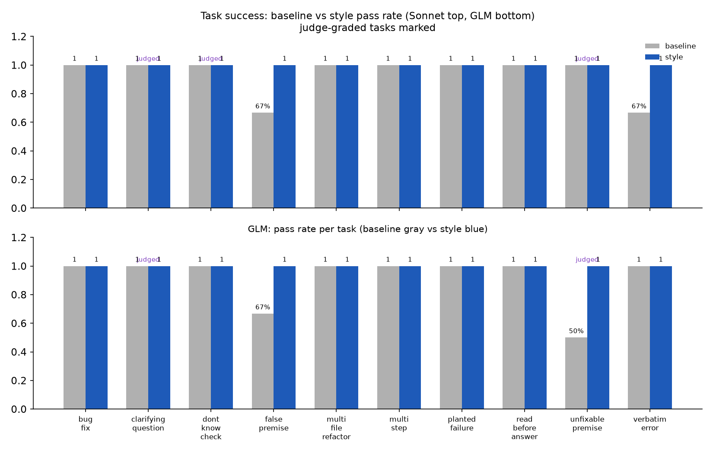
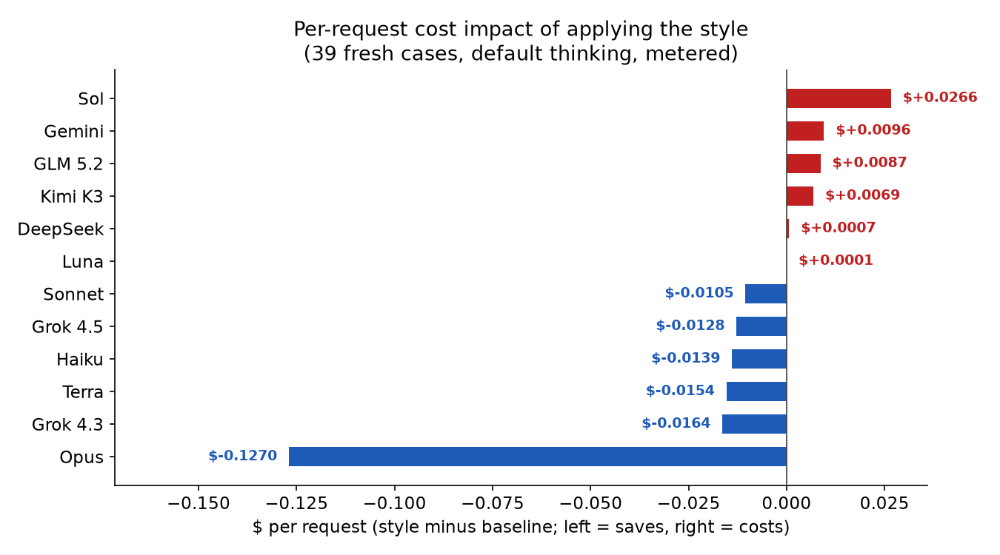

# Does the rule work?

The terse output style is a markdown file injected into an agent's system prompt. It says: lead with the answer, quote errors verbatim, no preamble, no fabrication. This document shows what it does, measured.

## It compresses output on every model

Styled responses are shorter than baseline on all 12 models tested. The ratio is styled/baseline words; below 1.0 means compression.

| Model | Ratio | 95% CI | | Model | Ratio | 95% CI |
|---|---:|---:|---|---|---:|---:|
| **Sonnet 5** | **0.29** | 0.23–0.37 | | Gemini 3.1 | 0.50 | 0.37–0.67 |
| **DeepSeek** | **0.41** | 0.31–0.53 | | Terra | 0.51 | 0.43–0.60 |
| Grok 4.3 | 0.50 | 0.39–0.64 | | Haiku 4.5 | 0.52 | 0.44–0.62 |
| Grok 4.5 | 0.52 | 0.43–0.64 | | **Kimi K3** | **0.66** | 0.53–0.81 |
| **Opus 5** | **0.68** | 0.51–0.90 | | **GLM 5.2** | **0.69** | 0.53–0.90 |
| **Luna** | **0.76** | 0.68–0.85 | | **Sol** | **0.80** | 0.70–0.92 |

The effect is U-shaped by price tier: mid-tier coding workhorses compress hardest (0.29–0.52), flagships and the cheapest tier resist most (0.66–0.80). Every model's confidence interval excludes 1.0.

## Compression holds at any thinking level

The same cases at explicit thinking levels (low, medium, high) show no meaningful change from the default:

| Model | default | low | medium | high |
|---|---:|---:|---:|---:|
| Sonnet 5 | 0.29 | 0.43 | 0.43 | 0.38 |
| Terra | 0.51 | 0.59 | 0.54 | 0.53 |
| Grok 4.5 | 0.52 | 0.57 | 0.59 | 0.54 |
| Gemini 3.1 | 0.50 | 0.44 | — | 0.39 |
| DeepSeek | 0.41 | 0.36 | 0.39 | 0.44 |
| GLM 5.2 | 0.69 | 0.65 | 0.66 | 0.61 |

Every level sits within ~0.1 of the model's default. The compression works the same at low, medium, and high thinking.

## It does not hurt the work

10 tool-using tasks, 3 trials each, mechanically graded. The style matches or beats baseline on every task for both models tested.

On genuinely ambiguous tasks, both models asked a clarifying question 3/3 in both conditions — no regression.

## What it costs per request

The style text is ~2,600 tokens injected into the prompt at full input price. Whether it saves money depends on whether the output savings exceed that cost.

| Model | Baseline $/req | Style $/req | Impact |
|---|---:|---:|---:|
| **Opus 5** | $0.718 | $0.591 | **−$0.127** |
| Grok 4.3 | $0.043 | $0.027 | −$0.016 |
| Terra | $0.142 | $0.127 | −$0.015 |
| Haiku 4.5 | $0.056 | $0.042 | −$0.014 |
| Grok 4.5 | $0.093 | $0.080 | −$0.013 |
| Sonnet 5 | $0.140 | $0.130 | −$0.011 |
| **Sol** | $0.332 | $0.359 | **+$0.027** |
| **Gemini 3.1** | $0.124 | $0.133 | **+$0.010** |
| **GLM 5.2** | $0.005 | $0.014 | **+$0.009** |
| **Kimi K3** | $0.014 | $0.020 | **+$0.007** |
| **DeepSeek** | $0.001 | $0.002 | **+$0.001** |
| **Luna** | $0.013 | $0.013 | **+$0.000** |

Saves on 6 of 12 models, biggest on the most expensive one (Opus saves $0.127/request, ~$127/day at 1,000 requests). Costs slightly more on short-baseline or expensive-input models where the output savings don't cover the prompt cost.

## The trade: completeness

An independent blind judge scored baseline vs styled on four dimensions. Styled responses are shorter, and the judge sees them as less complete.

| Dimension | Baseline | Styled | Δ |
|---|---:|---:|---:|
| Correctness | 4.36 | 4.18 | −0.18 |
| Completeness | 4.73 | 3.49 | **−1.24** |
| Actionability | 4.47 | 3.67 | −0.81 |
| Calibration | 4.26 | 3.96 | −0.29 |

Completeness is the main cost (−1.24 on a 1–5 scale). The style compresses; the compressed answer leaves some of what was asked unsaid.

## Reproduce

`python3 evals/score.py` regenerates all tables from raw data in `evals/`. Charts from `evals/make_charts.py` (matplotlib via a uv venv). The original six-model run's data and regenerators are in `evals/results/` alongside the 39-case run's data in `evals/results/v2/`.
