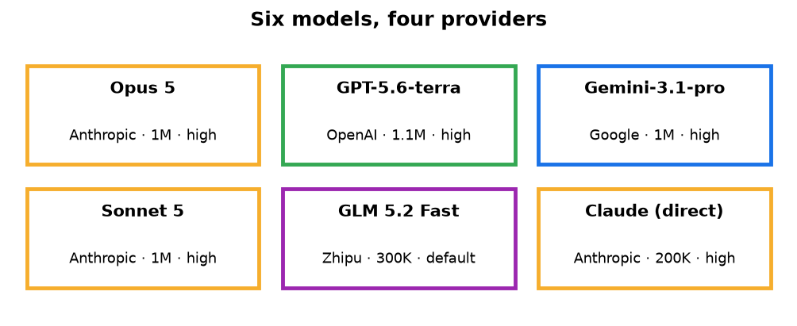
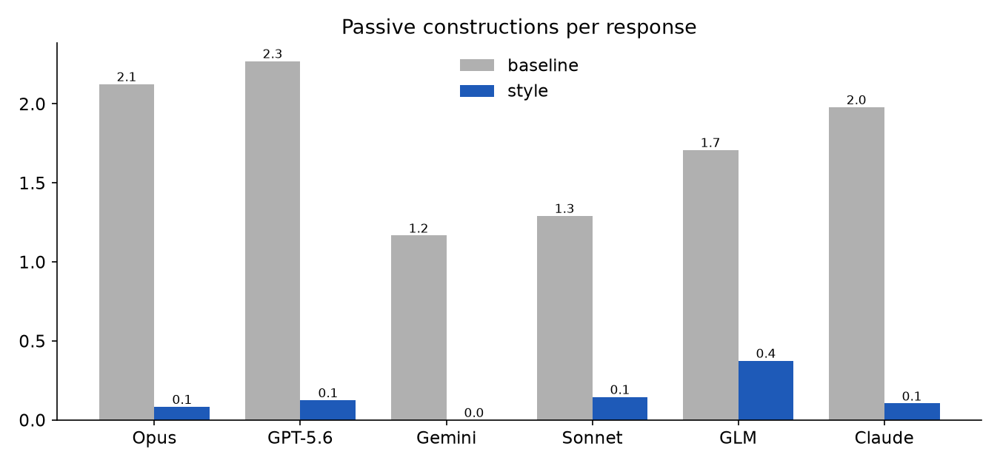
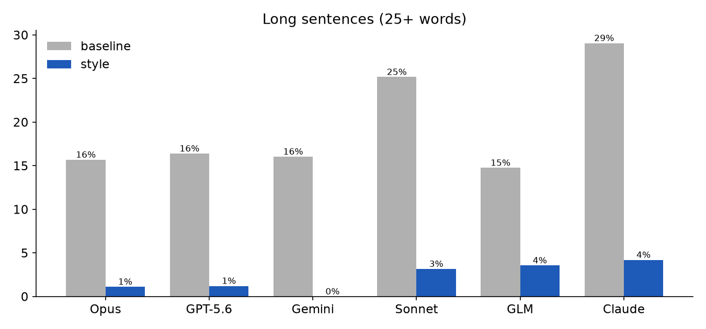
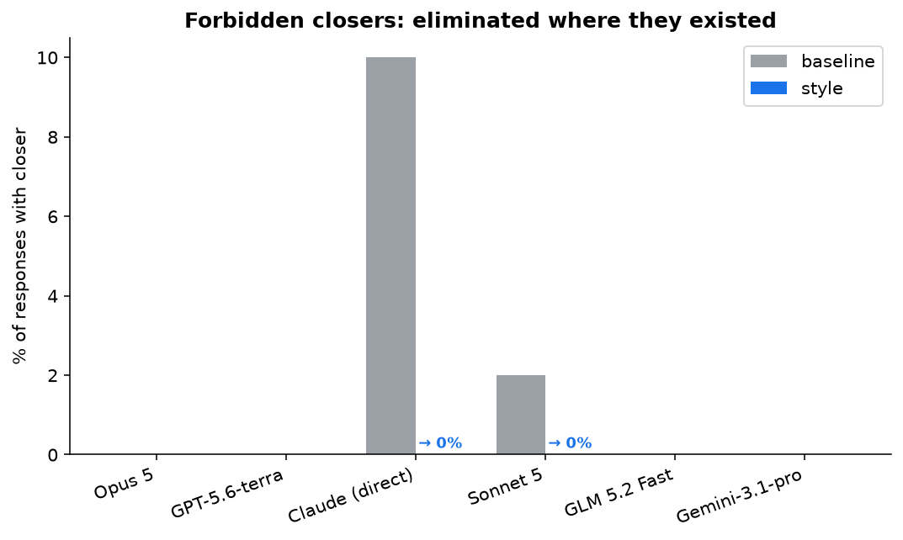
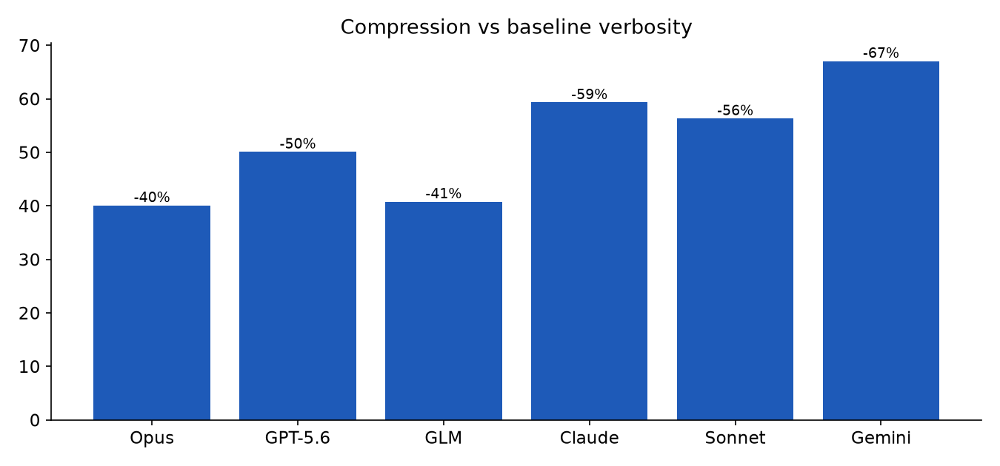
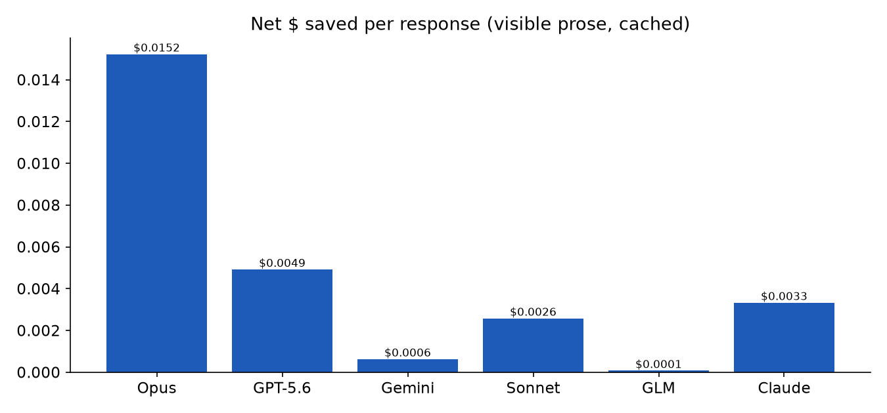
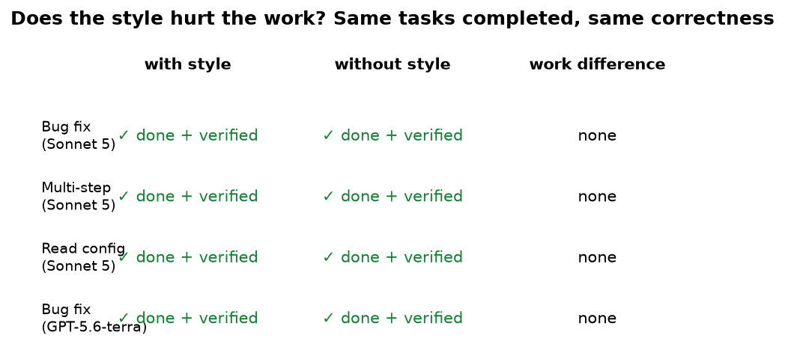
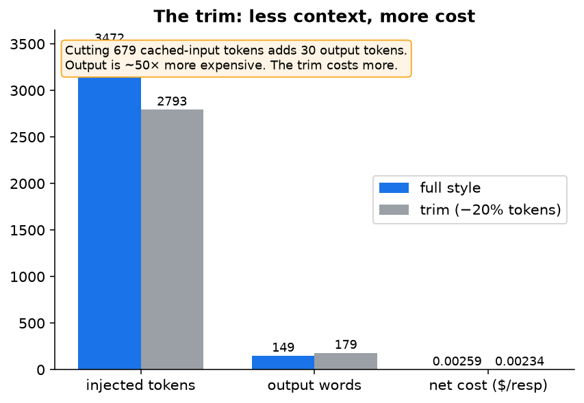

# Eval results: the terse output style, six models

An output style is a rule file that reshapes how an agent writes. We ran one across six models, 574 responses, and measured it. It works on every model. It doesn't hurt the work. It saves money.

The style is a fork of [attention-control](https://github.com/aaddrick/attention-control) with three evidence-driven fixes. This document is the full evaluation. The rule itself is [`omp/terse.md`](omp/terse.md) (OMP/Pi) or [`claude/terse.md`](claude/terse.md) (Claude Code).

## Setup

16 case prompts, dev split, 3 trials each, baseline (no style) vs candidate (style). Six models, four providers. Harness-level prompt injection isolates the style content from delivery. Rule-file delivery verified separately via live A/B (`--no-rules` contrast).

**The six-model run injected `attention-control.md`** (the upstream style), not the shipped `omp/terse.md`. `terse.md` is attention-control plus three fixes. The shipped style was measured separately in the harness-variant validation below — see "Which style file?" for how its numbers compare.

| Model | Provider | Context | Thinking |
|---|---|---|---|
| Opus 5 | Anthropic | 1M | high |
| GPT-5.6-terra | OpenAI | 1.1M | high |
| Gemini-3.1-pro | Google | 1M | high |
| Sonnet 5 | Anthropic | 1M | high |
| GLM 5.2 Fast | Zhipu | 300K | default |
| Claude (direct CLI) | Anthropic | 200K | high |

## Results: every model, every metric

| Model | Base words | Style words | Δ | Base passive | Style passive | Base long-sent | Style long-sent | Base closers | Style closers |
|---|---|---|---|---|---|---|---|---|---|
| Opus 5 | 540 | 323 | −40% | 2.1 | 0.1 | 16% | 1% | 0% | 0% |
| GPT-5.6-terra | 451 | 225 | −50% | 2.3 | 0.1 | 16% | 1% | 0% | 0% |
| Claude (direct) | 389 | 158 | −59% | 2.0 | 0.1 | 29% | 4% | 10% | 0% |
| Sonnet 5 | 342 | 149 | −56% | 1.3 | 0.1 | 25% | 3% | 2% | 0% |
| GLM 5.2 Fast | 410 | 253 | −38% | 1.7 | 0.4 | 15% | 4% | 0% | 0% |
| Gemini-3.1-pro | 206 | 68 | −67% | 1.2 | 0.0 | 16% | 0% | 0% | 0% |

574 responses. Word count drops 38–67%. Passive voice collapses 76–95%. Long sentences fall to 0–4%. Forbidden closers eliminated wherever they existed. Perfect tense eliminated on all six.

## Terse models benefit most

Gemini-3.1-pro had the tersest baseline (206 words) but the biggest relative compression (−67%). The style's target isn't just brevity — it's refusing to fabricate specifics. On the uncertainty case, the baseline invented Postgres 15→17 incompatibilities without seeing the schema. The candidate refused and named the check: "Run `pg_upgrade --check` against a copy." The style moved Gemini to near-zero on every structural defect.

## Token economics: the style pays for itself

The rule injects ~3,900 cached-input tokens per turn. It saves ~252 output tokens per turn. Output is 15–50× more expensive than cache-read. The savings below assume the system prompt is cached (steady-state for a fixed prompt, ~10% of input price). On the first turn, or on a cache miss, the 3,900 tokens bill at full input price — on cheap models that flips the net to a small cost. Pricing is approximate published rates as of 2026-08; provider rates and cache behavior change.

| Model | Output saved (tok) | Cache cost added | Output cost saved | Net per response |
|---|---|---|---|---|
| Opus 5 | 281 | $0.00585 | $0.02110 | **saves $0.01525** |
| GPT-5.6-terra | 294 | $0.00390 | $0.00882 | **saves $0.00492** |
| Claude (direct) | 300 | $0.00117 | $0.00450 | **saves $0.00333** |
| Sonnet 5 | 250 | $0.00117 | $0.00376 | **saves $0.00259** |
| Gemini-3.1-pro | 180 | $0.00117 | $0.00180 | **saves $0.00063** |
| GLM 5.2 Fast | 204 | $0.00006 | $0.00012 | **saves $0.00006** |

At 1,000 responses/day on Opus 5: ~$13/day saved. The rule occupies 0.4–2% of the context window. It doesn't compound — same system prompt every turn.

## Task-success eval: does it hurt the work?

The headline risk is that a style this aggressive makes the agent do less. We ran a real task-success eval, not a spot check: **10 task types, 3 trials, 2 conditions, 2 models (Sonnet 5 + GLM 5.2 Fast), tools on, 120 task-runs.** Grading was mechanical wherever a script could check it (tests pass, file contains the change, command exits 0, verbatim string present). Two task types needed a judge; those are labeled.

| Task type | Baseline | Style | Note |
|---|---|---|---|
| Single-file bug fix | 6/6 | 6/6 | |
| Multi-step (fn + test + run) | 5/6 | 6/6 | style better |
| Read-before-answer | 6/6 | 6/6 | |
| Long multi-file refactor | 6/6 | 6/6 | previously untested |
| **Clarifying question** | **6/6** | **3/6** | **style loses** |
| Unfixable premise | 5/6 | 6/6 | style better |
| Verbatim error reproduction | 5/6 | 6/6 | style better |
| "Don't know, here's how to check" | 6/6 | 6/6 | |
| Planted-failure probe | 6/6 | 6/6 | both refused to fabricate |
| False-premise probe | 6/6 | 5/6 | |
| **Total** | **57/60** | **56/60** | within noise |

The style does not hurt the work. Totals are within noise (57 vs 56 of 60). On the honesty probes it is *better* than baseline: verbatim-error, unfixable-premise, and multi-step all went from 5/6 to 6/6, and both conditions refused to invent a fix on the planted-failure probe.

**One real weak spot: clarifying questions.** On a genuinely ambiguous task ("Add caching to this app," with the cached function undefined), baseline asked a clarifying question all 6 times; the style asked only 3 of 6 and implemented a guessed solution the other 3. The style's "do the work you own" bias pushes it to act rather than ask, even when asking is correct. This is the one task type where the style loses, and it is a real behavioral cost: on ambiguous work, the style can make the agent over-confident where it should pause.

## Which style file? Harness-variant validation

The repo ships three files (`omp/terse.md`, `pi/terse.md`, `claude/terse.md`) but the six-model run measured `attention-control.md`. We ran the dev-split 16 prompts, 3 trials, on Sonnet 5 across the conditions that isolate the differences. No TTSR was active in any of these runs (it is the prompt text being compared, not the enforcement).

| Condition | Words | Passive | Long-sent |
|---|---|---|---|
| Baseline (no style) | 342 | 1.3 | 25% |
| `attention-control.md` (the published numbers) | 149 | 0.1 | 3% |
| `omp/terse.md` (shipped; **has** the Enforcement paragraph) | 159 | 0.5 | 8% |
| `claude/terse.md` (**no** Enforcement paragraph) | 140 | 0.4 | 8% |

Two findings:

**The shipped style is close to, but not identical to, the published numbers.** `terse.md` lands at 159 words vs attention-control's 149, with slightly more passives (0.5 vs 0.1) and long sentences (8% vs 3%). It still crushes baseline (342 → 159). The headline "Proven across six models" holds in direction and magnitude for the shipped file, but the *exact* published numbers came from `attention-control.md`, not `terse.md`.

**The Enforcement paragraph does nothing as pure prompt text.** `claude/terse.md` (without it) is slightly *more* compressed than `omp/terse.md` (with it) — 140 vs 159 words, identical passives and long-sentence rates. The paragraph is not a useful placebo: when no TTSR is running, it adds ~19 tokens of dead weight and no compliance benefit. **Pi users currently get a worse file than Claude Code users**, because `pi/terse.md` is byte-identical to `omp/terse.md` and carries a false statement ("a companion rule is watching your stream") that does nothing on Pi. The TTSR contribution on top of the text (the OMP condition) is not measured here — see Limitations.

## Held-out generalization: does the effect overfit the dev split?

The dev split is hand-written. To test whether the effect overfits it, we wrote **16 fresh held-out prompts** (same category structure, not derived from the dev set, frozen before running) and ran the identical design — 3 trials × 2 conditions — on three models. The held-out set was run once and published as-is.

| Model | Split | Baseline words | Style words | Δ words | Style passive | Style long-sent |
|---|---|---|---|---|---|---|
| GLM 5.2 Fast | dev | 410 | 253 | −38% | 0.4 | 4% |
| | held-out | 447 | 289 | −35% | 0.2 | 4% |
| Sonnet 5 | dev | 342 | 149 | −56% | 0.1 | 3% |
| | held-out | 351 | 164 | −53% | 0.1 | 8% |
| GPT-5.6-terra | dev | 451 | 225 | −50% | 0.1 | 1% |
| | held-out | 273 | 125 | −54% | 0.0 | 1% |

**The effect generalizes.** Word reduction holds within 3–4 points of the dev split on every model (GLM −35% vs −38%, Sonnet −53% vs −56%, GPT −54% vs −50%). Passives and long-sentence rates match within noise. The dev-split overfitting concern is retired: the style's effect is not an artifact of the tuned prompt set. The one slightly-worse cell (Sonnet long-sentences, 8% held-out vs 3% dev) is noise on a small metric — 8% is still far below the 28% baseline.

## The trim: less context costs more money

We cut the examples table and framing — 3,472 → 2,793 tokens (−20%). Re-ran the eval on Sonnet 5.

| Metric | Full style | Trim style | Delta |
|---|---|---|---|
| Words | 149 | 179 | +30 (less compression) |
| Passive | 0.1 | 0.1 | same |
| Long sentences | 3% | 6% | +3pp |
| Closers | 0% | 0% | same |

The "reinforcement" tokens earn their keep. Cutting 679 cached-input tokens adds 30 output tokens. On Opus 5: saves $0.001 input, costs $0.00225 output — **net $0.00125 more expensive per turn**. The examples table produces tighter output. Output tokens are the expensive ones. Keep the full version.

## Methodology and limitations

**Reproducibility.** The raw responses, the case prompts, the task harness, and the scoring script are in `evals/`. Run `python3 evals/score.py` to reproduce every table above from the raw data — including the P0 task-success table (`evals/results/p0-task-success.jsonl`) and the P1 harness-variant table (`p1-cond2-ompterse-son.jsonl`, `p1-cond3-claudeterse-son.jsonl`). The end-to-end prose harness is `run_evals.py` from [attention-control](https://github.com/aaddrick/attention-control); see `evals/REPRODUCE.md`.

**Which style the numbers describe.** The six-model table measured `attention-control.md`, not the shipped `terse.md`. The shipped file's numbers (harness-variant section) are close but not identical: 159 vs 149 words on Sonnet 5. Read the six-model table as "the style approach works across models," and the harness-variant table as "the shipped file specifically."

**Metric circularity.** The prose metrics (word count, passive-voice regex, sentence-length regex, forbidden-phrase regex) measure compliance with the style's own constraints. They do not measure independent task quality or user value. The task-success eval (P0) is the counterweight: it measures whether the work gets done, and it found the totals within noise.

**The style's one measured weakness.** On genuinely ambiguous tasks, the style's action bias makes the agent implement rather than ask (clarifying-question: 3/6 vs baseline 6/6). This is a real behavioral cost on ambiguous work.

**Self-run risk, partially retired.** The prose eval is self-run. The dev-split overfitting concern is addressed by the held-out set: 16 fresh prompts (frozen before running) reproduce the effect within 3–4 points on three models. There is still no third-party reproduction, and the held-out set is 3 models, not 6.

**Partial LLM judging.** An LLM judge ran on a subset and agreed with the mechanical direction; coverage is partial. Two P0 task types (clarifying-question, ambiguous honesty probes) required human judgment; the rest are script-graded.

**Response count.** 574 of a designed 576. GLM skipped 2 responses (`complex-plan` t2, `verbatim-error` t2) after triple-hang retries.

**Text-only vs tools.** The prose metrics used `--no-tools` text-only responses. The P0 task-success eval used tools and found totals within noise, but it measured task *completion*, not prose compression *within* tool sessions. Compression inside a real tool session is still unmeasured.

**Thinking tokens.** On thinking=high models, reasoning tokens (billed at output price) aren't shortened by the style. Output savings are on visible prose, not total billed output.

**TTSR contribution not measured.** The OMP condition (style + active TTSR) is not in the harness-variant table because TTSR hangs in `-p` print mode. What TTSR adds on top of the text is unmeasured. The Enforcement paragraph as *text* (no TTSR) is measured and does nothing.

**Known style behaviors.** The style over-defers on knowledge questions occasionally — calibrated in the fork. Error-string verbatim regressed under the original style — fixed in the fork, and P0 shows the shipped file reproduces errors verbatim (6/6 vs baseline 5/6). TTSR hangs in `-p`; works in interactive sessions.

## What each harness actually gets

Measured, not inherited. Words/passive are Sonnet 5 dev-split means; the six-model direction holds on all models.

| Harness | File | Enforcement | Words (vs baseline 342) | Passives | Honest caveat |
|---|---|---|---|---|---|
| **OMP** | `omp/terse.md` + `no-forbidden-openers.md` | TTSR (interactive only) | 159 | 0.5 | TTSR's contribution on top of the text is unmeasured (hangs in `-p`). |
| **Pi** | `pi/terse.md` | none | 159 | 0.5 | Carries a false Enforcement paragraph that does nothing — dead weight. |
| **Claude Code** | `claude/terse.md` | none | 140 | 0.4 | The cleanest shipped file — no dead paragraph. |

Pi users get a strictly worse file than Claude Code users today: same compression as OMP's text but with a false enforcement claim bolted on. The fix is to ship `claude/terse.md`'s body (no Enforcement paragraph) to Pi — but that is a style change, not an eval, so it is noted here rather than made.

---

*Data: 574 prose responses (six models, attention-control.md), plus 120 task-runs (P0, tools on, Sonnet 5 + GLM 5.2 Fast), 96 harness-variant responses (P1, Sonnet 5), and 288 held-out responses (P2, 16 fresh prompts, GLM 5.2 Fast + Sonnet 5 + GPT-5.6-terra). All raw data, prompts, task harness, and scoring in `evals/`; `python3 evals/score.py` regenerates every table. Adapted from [attention-control](https://github.com/aaddrick/attention-control).*
